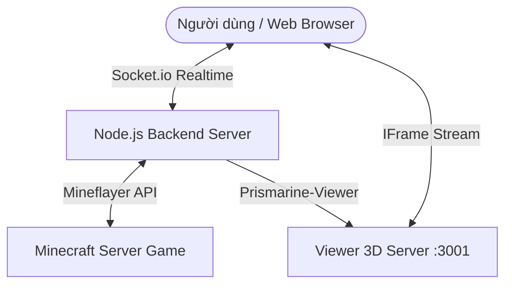

# ❖ Cyberpunk BotMine Client - Hướng Dẫn Sử Dụng ❖

Chào mừng bạn đến với **BotMine Client** – Hệ thống quản lý Minecraft Bot thế hệ mới với giao diện web Cyberpunk (Onion / Salarixi theme) cực kỳ cao cấp, hỗ trợ luồng Camera 3D thời gian thực, điều hướng di chuyển/xoay góc nhìn linh hoạt, và cơ chế tự động giải quyết Captcha/AuthMe thông minh.

---

## ─── ❖ SƠ ĐỒ HỆ THỐNG (ARCHITECTURE) ❖ ───

Dưới đây là mô hình hoạt động đa tầng của dự án, đảm bảo độ trễ thấp và giao diện hiển thị realtime mượt mà:



---

## ─── ❖ CÁC TÍNH NĂNG NỔI BẬT ❖ ───

| Tính năng | Mô tả chi tiết | Trạng thái |
| :--- | :--- | :--- |
| **Giao diện Web Cyberpunk** | Thiết kế tối giản, tông màu Neon Tím - Hồng Salarixi hiện đại, hiệu ứng phát sáng chuyển động. | `Hoàn thành` |
| **Camera 3D Realtime** | Xem trực tiếp góc nhìn thứ nhất (FPP) của bot bằng Canvas 3D qua thư viện `prismarine-viewer`. | `Hoàn thành` |
| **Bảng Điều Hướng Kép** | Hỗ trợ cụm phím ảo WASD và cụm Xoay Nhìn (Look D-Pad) bằng chuột hoặc bàn phím. | `Hoàn thành` |
| **Phân Loại Kênh Chat** | Tách biệt tab chat: **Tất cả**, **Kênh chung**, **Nhắn riêng (PM/Whisper)** có đếm tin nhắn, và **Hệ thống**. | `Hoàn thành` |
| **Auto-Auth & Captcha** | Tự động nhận diện biển báo, Action Bar, Boss Bar chứa captcha để giải, và tự động đăng nhập/đăng ký. | `Hoàn thành` |
| **Bảo Vệ Chống Spoofing** | Bỏ qua các tin nhắn dụ dỗ của người chơi khác trong chat công khai/nhắn riêng để bảo vệ thông tin mật. | `Hoàn thành` |

---

## ─── ❖ HƯỚNG DẪN CÀI ĐẶT & CHẠY ❖ ───

> [!IMPORTANT]
> **Yêu cầu hệ thống:**
> - Máy tính đã cài đặt **Node.js** (Phiên bản khuyến nghị: từ v18 trở lên).
> - Trình duyệt web hiện đại hỗ trợ WebGL (Chrome, Edge, Firefox, Brave).

### Bước 1: Cài đặt thư viện (Dependencies)
Mở cửa sổ dòng lệnh (Terminal/PowerShell) tại thư mục `backend/` của dự án và chạy lệnh:
```bash
cd backend
npm install
```

### Bước 2: Khởi động Backend Server
Khởi chạy máy chủ Node.js để kết nối và điều khiển bot:
```bash
node server.js
```
> [!NOTE]
> - Máy chủ backend mặc định sẽ chạy ở cổng `3000`.
> - Cổng stream Camera 3D mặc định sẽ chạy ở cổng `3001`.

### Bước 3: Mở giao diện Control Panel (Frontend)
Bạn chỉ cần mở trực tiếp file `frontend/index.html` bằng trình duyệt web bất kỳ, hoặc chạy một live-server cục bộ.

---

## ─── ❖ PHÍM TẮT ĐIỀU KHIỂN (KEYBOARD SHORTCUTS) ❖ ───

Khi nhấn chuột vào một khu vực trống trên Web Control Panel (đảm bảo không focus vào ô nhập liệu), bạn có thể sử dụng các phím tắt sau:

> [!TIP]
> Các phím tắt sẽ tự động bị tạm ngắt kích hoạt khi bạn đang gõ trong các ô nhập như `Khung Chat` hoặc `Mật khẩu` để tránh xung đột phím.

### Cụm Di chuyển (Movement)
*   `W`: Đi thẳng (Forward)
*   `S`: Đi lùi (Backward)
*   `A`: Đi ngang sang trái (Strafe Left)
*   `D`: Đi ngang sang phải (Strafe Right)
*   `Space (Dấu cách)`: Nhảy lên (Jump)
*   `Shift`: Cúi người / Đi chậm (Sneak)
*   `Control`: Chạy nhanh (Sprint)

### Cụm Xoay Góc Nhìn (Camera Look)
*   `▲ (Arrow Up)`: Quay đầu lên trên
*   `▼ (Arrow Down)`: Quay đầu xuống dưới
*   `◀ (Arrow Left)`: Quay đầu sang trái
*   `▶ (Arrow Right)`: Quay đầu sang phải

---

## ─── ❖ HƯỚNG DẪN BẢO MẬT & AUTO-SOLVE ❖ ───

> [!WARNING]
> Mặc dù hệ thống được trang bị tính năng **Tự Động Đăng Nhập** và **Tự Động Giải Captcha**, bạn cần lưu ý:

1.  **Chống dụ dỗ (Spoofing Protection):**
    *   Hệ thống sẽ quét cấu trúc tin nhắn bằng các bộ lọc regex nâng cao. Nếu một người chơi khác gửi tin nhắn riêng (Whisper) hoặc chat công khai chứa các cú pháp dạng `/login <mã>` hoặc yêu cầu giải mã xác thực, hệ thống sẽ **bỏ qua ngay lập tức** để tránh việc bị lừa tiết lộ thông tin mật.
2.  **Captcha bằng Hình ảnh Bản đồ (Map Captcha):**
    *   Khi bot nhận được bản đồ chứa ảnh captcha từ server Minecraft, một lớp phủ popup ảnh sẽ tự động hiện lên trên giao diện web. Hãy quan sát ảnh đó và nhập mã vào khung chat bên dưới để giải quyết thủ công nếu regex không nhận dạng được.
3.  **Lobby Auto-Jump:**
    *   Hệ thống sẽ tự động quét menu "Chọn máy chủ" khi bot vào sảnh chờ (Lobby) và click vào Survival Chill để đưa bot vào máy chủ chính mà không cần bạn can tiệp thủ công.

---

<p align="center">
  <b>© 2026 Huy Phan. All rights reserved.</b><br>
  <sub>Sản phẩm được tối ưu hóa và phát triển bởi Huy Phan.</sub>
</p>
