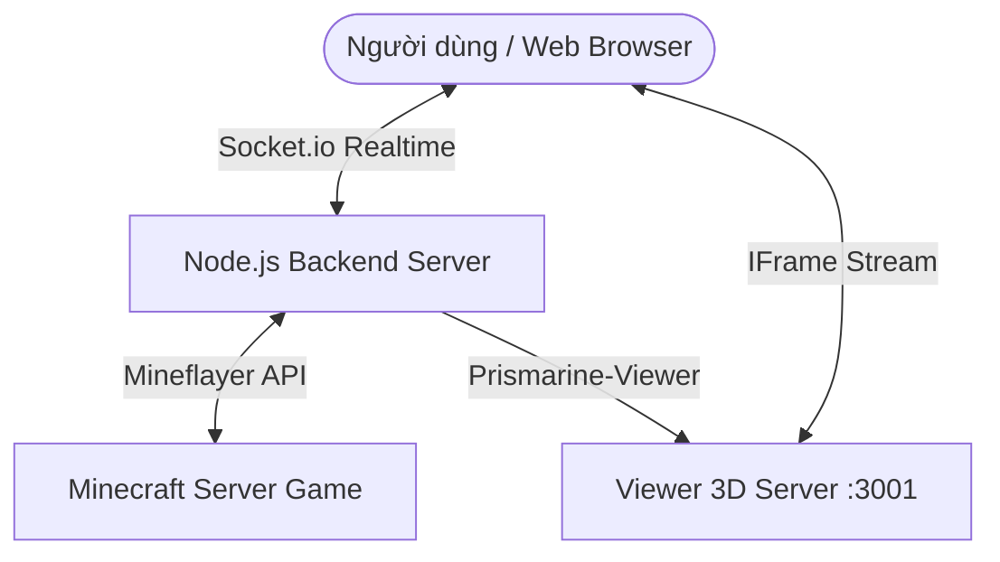

# Hướng Dẫn Sử Dụng Chi Tiết

Trang này cung cấp thông tin chi tiết về sơ đồ hệ thống, phím tắt điều khiển, và các cơ chế bảo mật tự động của **BotMine Client**.

---

## ─── ❖ SƠ ĐỒ HỆ THỐNG (ARCHITECTURE) ❖ ───

Dưới đây là mô hình hoạt động đa tầng của dự án, đảm bảo độ trễ thấp và giao diện hiển thị realtime mượt mà:

---

## ─── ❖ PHÍM TẮT ĐIỀU KHIỂN (KEYBOARD SHORTCUTS) ❖ ───

Khi nhấn chuột vào một khu vực trống trên Web Control Panel (đảm bảo không focus vào ô nhập liệu), bạn có thể sử dụng các phím tắt sau:

> [!TIP]
> Các phím tắt sẽ tự động bị tạm ngắt kích hoạt khi bạn đang gõ trong các ô nhập như `Khung Chat` hoặc `Mật khẩu` để tránh xung đột phím.

### Cụm Di chuyển (Movement)
*   `W`: Đi thẳng (Forward)
*   `S`: Đi lùi (Backward)
*   `A`: Đi ngang sang trái (Strafe Left)
*   `D`: Đi ngang sang phải (Strafe Right)
*   `Space (Dấu cách)`: Nhảy lên (Jump)
*   `Shift`: Cúi người / Đi chậm (Sneak)
*   `Control`: Chạy nhanh (Sprint)

### Cụm Xoay Góc Nhìn (Camera Look)
*   `▲ (Arrow Up)`: Quay đầu lên trên
*   `▼ (Arrow Down)`: Quay đầu xuống dưới
*   `◀ (Arrow Left)`: Quay đầu sang trái
*   `▶ (Arrow Right)`: Quay đầu sang phải

---

## ─── ❖ HƯỚNG DẪN BẢO MẬT & AUTO-SOLVE ❖ ───

> [!WARNING]
> Mặc dù hệ thống được trang bị tính năng **Tự Động Đăng Nhập** và **Tự Động Giải Captcha**, bạn cần lưu ý:

1.  **Chống dụ dỗ (Spoofing Protection):**
    *   Hệ thống sẽ quét cấu trúc tin nhắn bằng các bộ lọc regex nâng cao. Nếu một người chơi khác gửi tin nhắn riêng (Whisper) hoặc chat công khai chứa các cú pháp dạng `/login <mã>` hoặc yêu cầu giải mã xác thực, hệ thống sẽ **bỏ qua ngay lập tức** để tránh việc bị lừa tiết lộ thông tin mật.
2.  **Captcha bằng Hình ảnh Bản đồ (Map Captcha):**
    *   Khi bot nhận được bản đồ chứa ảnh captcha từ server Minecraft, một lớp phủ popup ảnh sẽ tự động hiện lên trên giao diện web. Hãy quan sát ảnh đó và nhập mã vào khung chat bên dưới để giải quyết thủ công nếu regex không nhận dạng được.
3.  **Lobby Auto-Jump:**
    *   Hệ thống sẽ tự động quét menu "Chọn máy chủ" khi bot vào sảnh chờ (Lobby) và click vào Survival Chill để đưa bot vào máy chủ chính mà không cần bạn can tiệp thủ công.

---

  <b>© 2026 Huy Phan. All rights reserved.</b> 
  Sản phẩm được tối ưu hóa và phát triển bởi Huy Phan.

